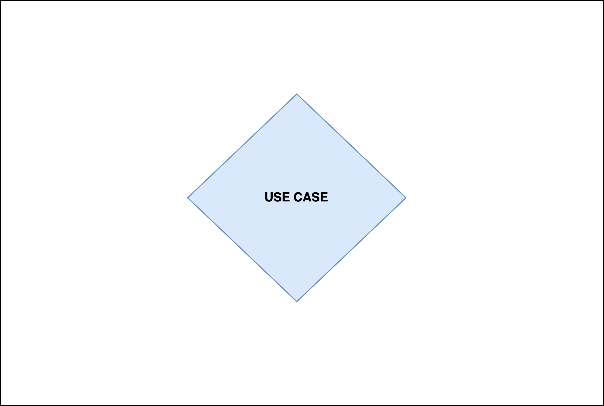
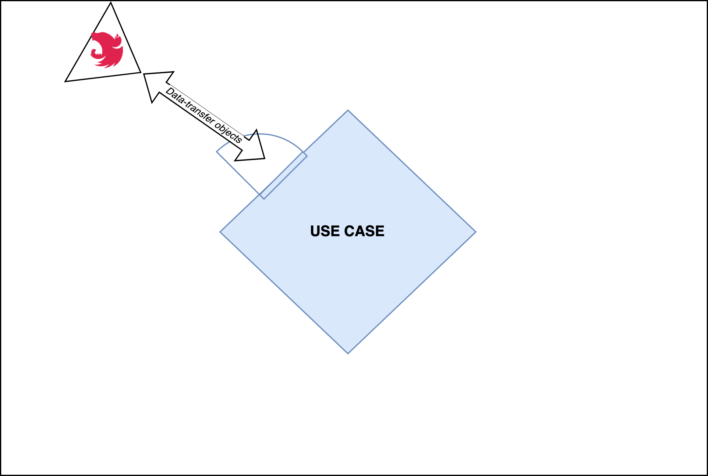
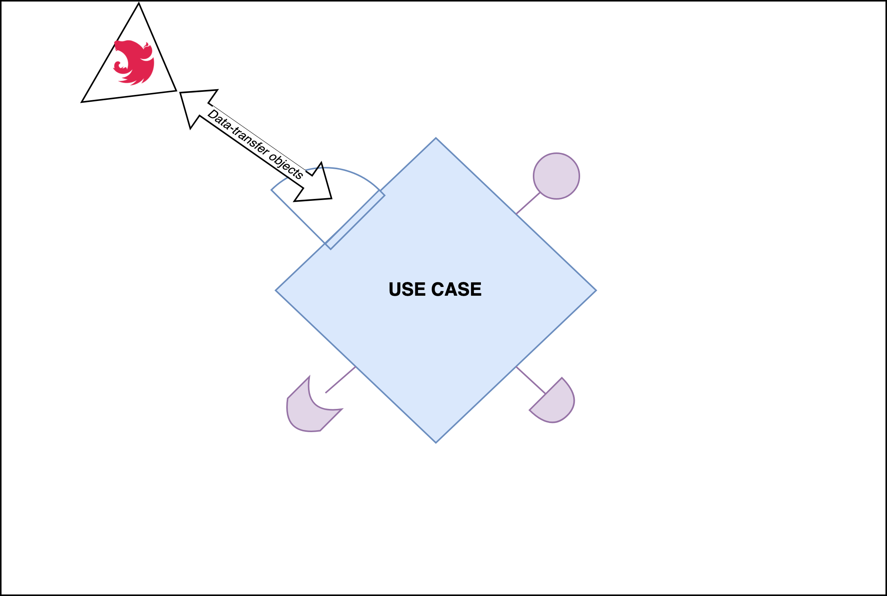
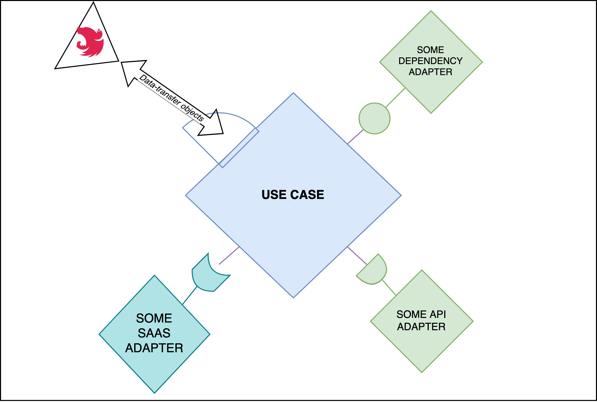
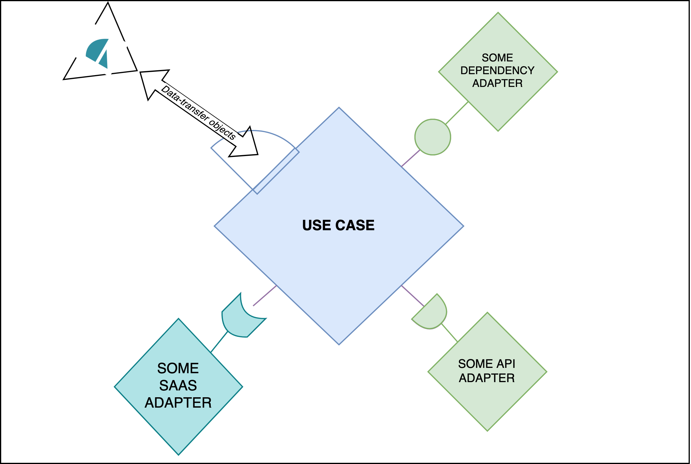
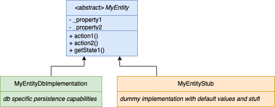

# Clean architecture

---

## Details

----

### The database

_<small>Don't base your data model on how it's actually stored</small>_

----

### The framework

_<small>Don't comply to the framework. Use the framework to comply to your business</small>_

----

### The interface

_<small>Don't tie your business to your interface</small>_

---

## Not details

----

### The business rules

----

#### **The entities**

- Object that contain or have easy access to business data
- They implement the critical business rules that operate on that data
- They are not plain-old TS objects representing the DB schema

----

#### **The use cases**

- They define the way an automated system is used
- They specify the inputs to be provided and outputs to be returned to the user
- They describe application-specific business rules
- They don't know in which environment they are running

---

## The dependency rule

---

## A use-case, step by step

----

<!-- .slide: data-transition="fade" -->

----

<!-- .slide: data-transition="fade" -->

----

<!-- .slide: data-transition="fade" -->

----

<!-- .slide: data-transition="fade" -->

----

<!-- .slide: data-transition="fade" -->

----

<!-- .slide: data-transition="fade" -->

----

<!-- .slide: data-transition="fade" -->

----

<!-- .slide: data-transition="fade" -->

---

## **Entities**, grosso modo

---

## Things to keep in mind

----

### Readability

_<small>Prosaic code is easier to read and understand</small>_

----

### Ubiquitous language

_<small>Use the same language in your code as in your business</small>_

> Use a glossary to be sure everybody use the same words
