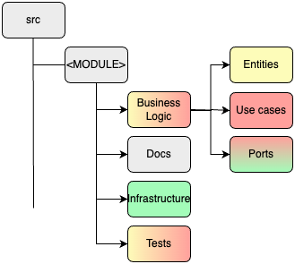

# Plan

- Introduction
- Context
- Etc.

---

## Introduction

- Team
- Topic
- Objectives of the presentation.
  - objective 1
  - objective 2
  - objective 3

> Best Team Ever.

Note: speaker notes FTW!

---

## Context

- Brand New Project. FREEEDOM! gif Frozen
- We are stuck with a legacy system (serviceApp => Sails.js). gif Titanic
- We need to manage permissions. gif Matrix

---

## Why clean architecture?

- Define clean architecture and its relevance to the project (SOLID, etc.)


- Explain the alignment of **clean** architecture principles with the project's goals.

---

## Architecture Overview 


---

## Architecture Overview 


---

### Implementation
#### Code Organization: Base organization


---

### Implementation
#### Code Organization: Business logic



---vertical

### Implementation
#### Business logic: Entity example 

```typescript
// permission.entity.ts
export abstract class Permission extends SoftDeleteEntity {
  // [...]

  protected _category: PermissionCategory
  get category() {
    return this._category
  }

  organize(category: PermissionCategory) {
    if (category.isMainCategory()) {
      throw new InvalidPermissionCategoryHierarchyError()
    }
    this._category = category
  }
}
```

---vertical

### Implementation
#### Business logic: Port example 
> **Use Case <- PORT (interface) -> Repository**

```typescript
// permission.port.ts
export interface PermissionPort {
  /**
   * @throws { PermissionNotFoundError }
   */
  findById(id: string): Promise<Permission>
}
```

---vertical

### Implementation
#### Business logic: Use case example 

```typescript
// get-all-permissions.use-case.ts
@Injectable()
export class GetAllPermissions {
  constructor(@Inject(PermissionPort) private permissionPort: PermissionPort) {}

  public async execute(): Promise<PermissionListItemOutput[]> {
    const permissions = await this.findAllPermissions()
    return this.mapOutput(permissions)
  }

  private findAllPermissions(): Promise<Permission[]> {
    return this.permissionPort.findAll()
  }

  private mapOutput(permissions: Permission[]) {
    return permissions.map((permission) =>
      PermissionMapper.toListItemOutput(permission),
    )
  }
}
```

---

### Implementation
#### Infrastructure


---vertical

### Implementation
#### Infrastructure: Persistence

```typescript
@Injectable()
export class PermissionPortImpl implements PermissionPort {
  constructor(private readonly permissionRepository: PermissionRepository) {}

  
  async findById(id: string): Promise<Permission> {
    const permission = await this.permissionRepository.findPermissionById(id)

    if (!permission) {
      throw new PermissionNotFoundError(id)
    }

    return plainToInstance(PrismaPermission, permission)
  }
  
  async create(permission: PrismaPermission): Promise<Permission> {
    try {
      const created =
        await this.permissionRepository.createPermission(permission)

      return plainToInstance(PrismaPermission, created)
    } catch (error) {
      if (error.code === 'P2002') {
        throw new PermissionAlreadyExistsError(permission.id)
      }

      throw error
    }
  }

  // [...]  
}
```

---vertical

### Implementation
#### Infrastructure: Controllers

```typescript
// reorganize-permission.controller.ts
@ApiTags('Permissions')
@UseInterceptors(PermissionErrorInterceptor)
@UseGuards(SuperAdminAuthGuard)
@Controller('permission')
export class ReorganizePermissionController {
  constructor(private readonly useCase: ReorganizePermission) {}

  @ApiRoute({
    summary: 'Reorganize permissions',
    ok: {
      description: 'Permission reorganized',
      type: PermissionDetailedResponseDto,
    },
    unauthorized: {},
    forbidden: {},
    internalServerError: {},
  })
  @ApiBearerAuth()
  @Patch(':id/reorganize')
  async reorganizePermission(
    @Body() toUpdate: ReorganizePermissionBodyDto,
    @Param() params: ReorganizePermissionParamsDto,
  ) {
    const res = await this.useCase.execute({ ...toUpdate, ...params })
    return plainToInstance(PermissionDetailedResponseDto, res)
  }
}
```
---vertical

### Implementation
#### Infrastructure: Controllers

```typescript
export class ReorganizePermissionBodyDto {
  @IsInt()
  @Max(2147483647) // int4 max constraints (postgres)
  @Min(0) // should be -2147483647, but we take 0 since it will not be necessary
  newCategoryId: number
}

export class ReorganizePermissionParamsDto {
  @IsString()
  @IsNotEmpty()
  id: string
}
```

---vertical

### Implementation
#### Infrastructure: Mixins

```typescript
export const GetterSetterInheriter = <TBase extends Constructor>(
  Base: TBase,
) => {
  return class extends Base {
    constructor(...args: any[]) {
      super(...args)
      this.importGettersAndSetters()
    }

    getGettersAndSetters = (prototype: Constructor) => {
       // [...]
      }
      > = {}

      const findAllGettersAndSetters = (
        currentPrototype: Constructor,
        aggregator: Record<
          string,
          {
            get?: () => any
            set?: (_v: any) => void
            hasPrivateDeclaration?: boolean
          }
        > = {},
      ) => {
         // [...]
      return gettersSetters
    }

    importGettersAndSetters = () => {
      // [...]
    }
  }
}
```

---


### Implementation
#### Code Organization: Tests


---
