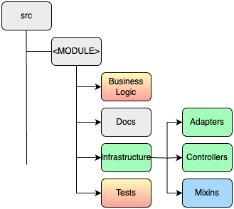
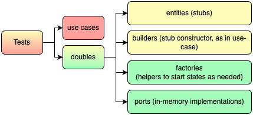

## Introduction
- Team
- Topic
- Objectives of the presentation.
  - objective 1
  - objective 2
  - objective 3

> Best Team Ever.

Note: speaker notes FTW!
---

## Context
- Brand New Project. FREEEDOM! gif Frozen
- We are stuck with a legacy system (serviceApp => Sails.js). gif Titanic
- We need to manage permissions. gif Matrix

---

## Clean Architecture

---

### What is Clean Architecture?
- **Purpose:** Design software with loose coupling and high cohesion.
- **Structure:** Organized into layers with:
  - **Entities** at the core (business objects and rules).
  - **Use Cases** encapsulating business logic.
  - **Interface Adapters** translating between web, database, and external agency formats.
  - **Frameworks & Drivers** as the outermost layer (UIs, databases).
- **Key Concept:** Dependency Rule - Dependencies must point inward, from outer layers to inner layers.

---

### SOLID Principles
solid-principles.md

---

---

### Benefits of Clean Architecture
- **Flexibility:** Easily adapt to new requirements without significant rework.
- **Testability:** Independent layers allow for unit testing of business logic without UI, database, or external dependencies.
- **Maintainability:** Simplified updates and enhancements with minimal impact on existing functionality.
- **Readability:** Clear separation of concerns makes it easier for product managers and new developers to understand the system structure.
- **Framework Independence:** Business rules are not tied to the technology stack, making it easier to switch frameworks or libraries.

---

## Architecture Overview 


---

## Architecture Overview 


---

### Implementation
#### Code Organization: Base organization


---

### Implementation
#### Code Organization: Business logic


---vertical

### Implementation
#### Business logic: Entity example 

```typescript
// permission.entity.ts
export abstract class Permission extends SoftDeleteEntity {
  // [...]

  protected _category: PermissionCategory
  get category() {
    return this._category
  }

  organize(category: PermissionCategory) {
    if (category.isMainCategory()) {
      throw new InvalidPermissionCategoryHierarchyError()
    }
    this._category = category
  }
}
```

---vertical

### Implementation
#### Business logic: Port example 
> **Use Case ← PORT (interface) → Repository**

```typescript
// permission.port.ts
export interface PermissionPort {
  /**
   * @throws { PermissionNotFoundError }
   */
  findById(id: string): Promise<Permission>
}
```

---vertical

### Implementation
#### Business logic: Use case example 

<span style="font-size:0.75em;">

```typescript
// get-all-permissions.use-case.ts
@Injectable()
export class GetAllPermissions {
  constructor(@Inject(PermissionPort) private permissionPort: PermissionPort) {}

  public async execute(): Promise<PermissionListItemOutput[]> {
    const permissions = await this.findAllPermissions()
    return this.mapOutput(permissions)
  }

  private findAllPermissions(): Promise<Permission[]> {
    return this.permissionPort.findAll()
  }

  private mapOutput(permissions: Permission[]) {
    return permissions.map((permission) =>
      PermissionMapper.toListItemOutput(permission),
    )
  }
}
```

</span>

---

### Implementation
#### Infrastructure



---vertical

### Implementation
#### Infrastructure: Persistence

```typescript
@Injectable()
export class PermissionPortImpl implements PermissionPort {
  constructor(private readonly permissionRepository: PermissionRepository) {}

  async findById(id: string): Promise<Permission> {
    const permission = await this.permissionRepository.findPermissionById(id)

    if (!permission) {
      throw new PermissionNotFoundError(id)
    }

    return plainToInstance(PrismaPermission, permission)
  }
  // [...]  
}

export class PrismaPermission extends GetterSetterInheriter(
  PrismaPermissionBase,
) {}
```

---vertical

### Implementation
#### Infrastructure: Controllers

<span style="font-size:0.75em;">

```typescript
// reorganize-permission.controller.ts
@ApiTags('Permissions')
@UseInterceptors(PermissionErrorInterceptor)
@UseGuards(SuperAdminAuthGuard)
@Controller('permission')
export class ReorganizePermissionController {
  constructor(private readonly useCase: ReorganizePermission) {}

  @ApiRoute(/** */)
  @ApiBearerAuth()
  @Patch(':id/reorganize')
  async reorganizePermission(
    @Body() toUpdate: ReorganizePermissionBodyDto,
    @Param() params: ReorganizePermissionParamsDto,
  ) {
    const res = await this.useCase.execute({ ...toUpdate, ...params })
    return plainToInstance(PermissionDetailedResponseDto, res)
  }
}
```

</span>

---vertical

### Implementation
#### Infrastructure: Controllers

<span style="font-size:0.8em;">

```typescript
export class ReorganizePermissionBodyDto {
  @IsInt()
  @Max(2147483647) // int4 max constraints (postgres)
  @Min(0) // should be -2147483647, but we take 0 since it will not be necessary
  newCategoryId: number
}

export class ReorganizePermissionParamsDto {
  @IsString()
  @IsNotEmpty()
  id: string
}
```
</span>

---vertical

### Implementation
#### Infrastructure: Mixins exemple 
**😮**

<span style="font-size:0.65em;">

```typescript
export const GetterSetterInheriter = <TBase extends Constructor>(
  Base: TBase,
) => {
  return class extends Base {
    constructor(...args: any[]) {
      super(...args)
      this.importGettersAndSetters()
    }
    getGettersAndSetters = (prototype: Constructor) => {
      // [...]
      const findAllGettersAndSetters = (
        currentPrototype: Constructor,
        aggregator: Record<string, { get?: () => any; set?: (_v: any) => void; hasPrivateDeclaration?: boolean }> = {}
      ) => 
      // [...]
    }
    importGettersAndSetters = () => { 
      const extendedClassPrototype: Constructor = Object.getPrototypeOf(this)
      const gettersSetters = this.getGettersAndSetters(extendedClassPrototype)
      // [...]
    }
  }
}
```

</span>

---

### Implementation
#### Code Organization: Tests


---vertical

### Implementation
#### Tests: Use case example 

> No mocks, in memory db

<span style="font-size:0.5em;">

```typescript
describe('GetAllPermissionsUseCase', () => {
  let permissionPort: InMemoryPermissionPort
  let useCase: GetAllPermissions

  describe('execute', () => {
    beforeEach(() => {
      const parentCategory = PermissionCategoryStubFactory.createMainCategory({
        id: 1,
      })

      permissionPort = new InMemoryPermissionPort([
        new PermissionStub({
          id: 'permission-id',
          scope: new ScopeStub({ id: 'permission-name' }),
          category: new PermissionCategoryStub({
            id: 2,
            labelKey: 'old-category-name',
            parentCategory: parentCategory,
          }),
        }),
      ])

      useCase = new GetAllPermissions(permissionPort)
    })
// [...]
```
</span>

---vertical

### Implementation
#### Tests: Doubles 



---vertical

### Implementation
#### Tests: Doubles → Ports 
**😮**

<span style="font-size:0.6em;">

```typescript
// base.port.in-memory.ts
const buildInMemoryPort = <EntityType>(args: {
  NotFoundError: typeof DomainError
  AlreadyExistsError?: typeof DomainError
}) => {
  class InMemoryBasePort {
    constructor(public entities: EntityType[]) {
      this.entities = entities
    }

// [...]
export const InMemoryBasePortMixin = <EntityType>(args: ...) => buildInMemoryPort<EntityType>(args)

// permission.port.in-memory.ts
export class InMemoryPermissionPort
  extends InMemoryBasePortMixin<Permission>({
    NotFoundError: PermissionNotFoundError,
    AlreadyExistsError: PermissionAlreadyExistsError,
  })
  implements PermissionPort
{
  findAll(): Promise<Permission[]> {
    return Promise.resolve(this.entities)
  }
}

```
</span>
