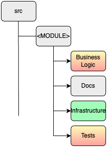
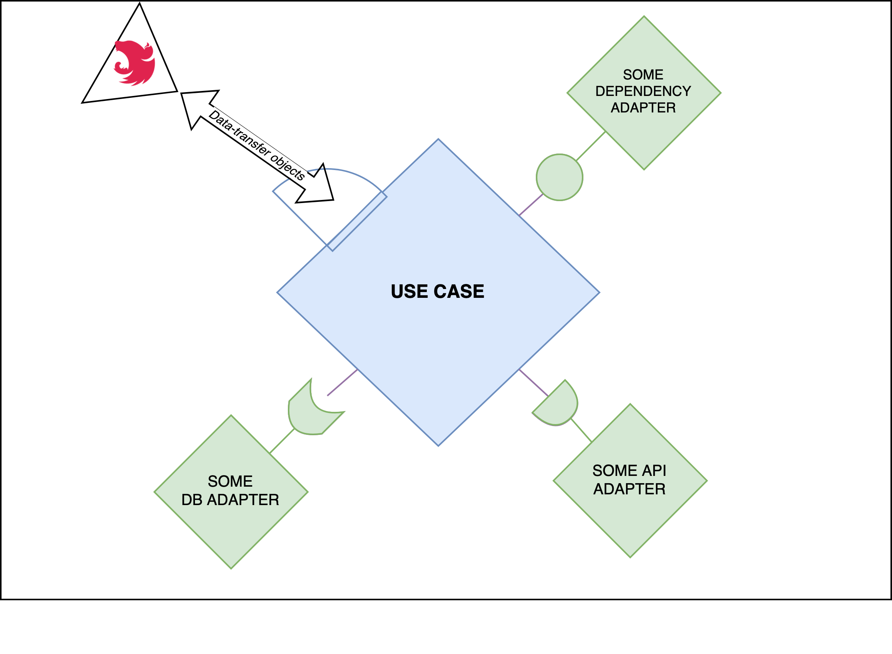

## Introduction
- Team
- Topic
- Objectives of the presentation.
  - objective 1
  - objective 2
  - objective 3

> Best Team Ever.

Note: speaker notes FTW!
---

## Context
- Brand New Project. FREEEDOM! gif Frozen
- We are stuck with a legacy system (serviceApp => Sails.js). gif Titanic
- We need to manage permissions. gif Matrix

---

## Clean Architecture

---

### What is Clean Architecture?
- **Purpose:** Design software with loose coupling and high cohesion.
- **Structure:** Organized into layers with:
  - **Entities** at the core (business objects and rules).
  - **Use Cases** encapsulating business logic.
  - **Interface Adapters** translating between web, database, and external agency formats.
  - **Frameworks & Drivers** as the outermost layer (UIs, databases).
- **Key Concept:** Dependency Rule - Dependencies must point inward, from outer layers to inner layers.

---

### SOLID Principles
solid-principles.md

---

---

### Benefits of Clean Architecture
- **Flexibility:** Easily adapt to new requirements without significant rework.
- **Testability:** Independent layers allow for unit testing of business logic without UI, database, or external dependencies.
- **Maintainability:** Simplified updates and enhancements with minimal impact on existing functionality.
- **Readability:** Clear separation of concerns makes it easier for product managers and new developers to understand the system structure.
- **Framework Independence:** Business rules are not tied to the technology stack, making it easier to switch frameworks or libraries.

---

## Architecture Overview 


---

## Architecture Overview 


---

### Implementation
#### Code Organization: **Base organization**





---

### Implementation
#### Code Organization: **Business logic**


----

#### Implementation
##### Business logic: **Entity example** 

<span style="font-size:0.75em;">

> - Not a plain-old JS object representing a schema 
> - Encapsulation & SOLID → OPEN-CLOSE Principle (Software entities should be open for extension, but closed for modification)
> - Implement critical business rules that operates on business data

```typescript
// permission.entity.ts
export abstract class Permission extends SoftDeleteEntity {
  // [...]

  protected _category: PermissionCategory
  get category() {
    return this._category
  }

  organize(category: PermissionCategory) {
    if (category.isMainCategory()) {
      throw new InvalidPermissionCategoryHierarchyError()
    }
    this._category = category
  }
}
```
</span>

----

#### Implementation
##### Business logic: **Port example**

> - Decoupled: Port, can be used with various adapters as long as interface is respected 

<span style="font-size:0.8em;">

```typescript
// Use Case ← PORT (interface) → Repository
// permission.port.ts
export interface PermissionPort {
  /**
   * @throws { PermissionNotFoundError }
   */
  findById(id: string): Promise<Permission>
}
```
</span>

----

#### Implementation
##### Business logic: **Use case example** 

> - Prosaic language
> - Describe application-specific business rules
> - Delegate critical business rules to entities
> - SOLID → ISP (No client should be forced to depend on methods it does not use), DIP (Depend on abstractions, not on concretions)

<span style="font-size:0.7em;">

```typescript
// create-permission.use-case.ts
@Injectable()
export class CreatePermission {
  constructor(/** Dependency injection of port implementations, builder ...*/) {}

  public async execute(
    input: CreatePermissionInput,
  ): Promise<PermissionDetailedOutput> {
    const { id, scope, categoryId } = input

    const existingScope = await this.retrieveScope(scope)
    const existingCategory = await this.retrieveCategory(categoryId)

    const newPermission = this.buildPermission(id, existingScope)
    newPermission.organize(existingCategory)

    const createdPermission = await this.permissionPort.create(newPermission)

    return PermissionMapper.toDetailedOutput(createdPermission)
  }

  private async retrieveScope(scopeId: string): Promise<Scope> {
    return this.scopePort.findSingleById(scopeId)
  }

  private async retrieveCategory(
    categoryId: number,
  ): Promise<PermissionCategory> {
    return this.categoryPort.findById(categoryId)
  }

  private buildPermission(id: string, scope: Scope): Permission {
    return this.permissionBuilder.init().withId(id).withScope(scope).build()
  }
}
```

</span>

---

### Implementation
#### **Infrastructure**


----

### Implementation
#### Infrastructure: **Reminder (framework)**



----

#### Implementation
##### Infrastructure: **Controllers**

> - DRY (decorator reusability)
> - Declarative (meaningfull names for decorators, clear role of each)
> - Controller: answers 3 questions (no other responsability), 
>   - which kind of request can pass through. 
>   - which is the form of the data structure received. 
>   - which is the form of the data structure to be sent. 

<span style="font-size:0.7em;">

```typescript
// reorganize-permission.controller.ts
@ApiTags('Permissions')
@UseInterceptors(PermissionErrorInterceptor)
@UseGuards(SuperAdminAuthGuard)
@Controller('permission')
export class ReorganizePermissionController {
  constructor(private readonly useCase: ReorganizePermission) {}

  @ApiRoute(/** */)
  @ApiBearerAuth()
  @Patch(':id/reorganize')
  async reorganizePermission(
    @Body() toUpdate: ReorganizePermissionBodyDto,
    @Param() params: ReorganizePermissionParamsDto,
  ) {
    const res = await this.useCase.execute({ ...toUpdate, ...params })
    return plainToInstance(PermissionDetailedResponseDto, res)
  }
}
```

</span>

----

#### Implementation
##### Infrastructure: **Controllers**

> Small pause: implemented different interesting patterns & tools ^^
> - We choose a "blacklist" approach to avoud the `@Expose` & `@Exclude` verbose decorators
> - Nestjs Plugin to avoid `@ApiProperty` decorators

<span style="font-size:0.7em;">

```typescript
export class ReorganizePermissionBodyDto {
  @IsInt()
  @Max(2147483647) // int4 max constraints (postgres)
  @Min(0) // should be -2147483647, but we take 0 since it will not be necessary
  newCategoryId: number
}

export class ReorganizePermissionParamsDto {
  @IsString()
  @IsNotEmpty()
  id: string
}
```
</span>

----

### Implementation
#### Infrastructure: **Reminder (adapters & implementation)**


----

#### Implementation
##### Infrastructure: **Persistence**

> - Adapter (respects the port interface)
> - It interacts with the "external world" & returns a comprehensive expected data structure
> - Here, an interesting pain point: in this case, a prisma object returned, how to convert it to an entity-business-like object as output

<span style="font-size:0.7em;">

```typescript
// permission.port.impl.ts
@Injectable()
export class PermissionPortImpl implements PermissionPort {
  constructor(private readonly permissionRepository: PermissionRepository) {}

  async findById(id: string): Promise<Permission> {
    const permission = await this.permissionRepository.findPermissionById(id)

    if (!permission) {
      throw new PermissionNotFoundError(id)
    }

    return plainToInstance(PrismaPermission, permission)
  }
  // [...]  
}
```
</span>

<!-- ----

#### Implementation
##### Infrastructure: **Persistence, before we continue**

<span style="font-size:0.7em;"> *To Know:* </span>

- <span style="font-size:0.7em;"> getters, setters in JS are not singly inherited (if one getter/setter exists and you decalre the missing one, it will not inherit, it will overwrite and ignore)</span>
- <span style="font-size:0.7em;"> Prisma, the ORM we are using (db detail) </span>
  - <span style="font-size:0.7em;"> needs the schema properties getters & setters both to be declared </span>
  - <span style="font-size:0.7em;"> if schema properties are not explicitly exposed, it needs a toJSON method to expose them  </span> -->


----

#### Implementation
##### Infrastructure: **Persistence**

> - Prisma, the ORM we are using (db detail) 
>   - Needs the schema properties getters & setters both to be declared 
>   - Prisma compliant toJSON method allowing to map entity into prisma accepted fields

<span style="font-size:0.7em;">

```typescript
// permission.prisma.entity.ts
export class PrismaPermissionBase extends Permission implements PrismaAdapter {
  get categoryId() {
    return this._category?.id
  }

  set category(value: PrismaPermissionCategory) {
    this._category = plainToInstance(PrismaPermissionCategory, value)
  }

  // prisma compliant toJSON method allowing to map entity into prisma accepted fields
  toJSON() {
    id: this._id,
    scopeId: this._scope.displayFull(),
    categoryId: this._category.id,
    deletedAt: this._deletedAt,
  }
}

export class PrismaPermission extends GetterSetterInheriter(
  PrismaPermissionBase,
) {}
```
</span>

----

#### Implementation
##### Infrastructure: **Mixins exemple** 

> - Getters, setters in JS are not singly inherited <span style="font-size:0.7em;">(if one getter/setter exists and you decalre the missing one, it will not inherit, it will overwrite and ignore) </span>
> - So, why not to play with JS to achieve this?
> - Tool that builds the parent/child tree and recovers getters/setters & and match them in an "inherited way" 😮 </span>

<span style="font-size:0.6em;">

```typescript
// prisma-injector.mixin.ts 
export const GetterSetterInheriter = <TBase extends Constructor>(Base: TBase ) => {

  return class extends Base {  
    constructor(...args: any[]) {
      super(...args)
      this.importGettersAndSetters()
    }

    getGettersAndSetters = (prototype: Constructor) => {
      // [...]
      const findAllGettersAndSetters = (
        currentPrototype: Constructor,
        aggregator: Record<string, { 
          get?: () => any; 
          set?: (_v: any) => void; 
          hasPrivateDeclaration?: boolean 
        }> = {}
      ) => 
      // [...]
    }
    
    importGettersAndSetters = () => { 
      const extendedClassPrototype: Constructor = Object.getPrototypeOf(this)
      const gettersSetters = this.getGettersAndSetters(extendedClassPrototype)
      // [...]
    }
  }
}
```

</span>

---

### Implementation
#### **Tests**


----

### Implementation
#### Tests: **Reminder (adapters & implementation)**


----

### Implementation
#### Tests: **Doubles**


----

#### Implementation
##### Tests: **Doubles → Ports**

> - Adapter (respects the port interface)
> - In memory storage of state (entities)

<span style="font-size:0.7em;">

```typescript
// permission.port.in-memory.ts
export class InMemoryPermissionPort
  extends InMemoryBasePortMixin<Permission>({
    NotFoundError: PermissionNotFoundError,
    AlreadyExistsError: PermissionAlreadyExistsError,
  })
  implements PermissionPort
{
  findAll(): Promise<Permission[]> {
    return Promise.resolve(this.entities)
  }
}

```
</span>

<!-- ----

#### Implementation
##### Tests: **Doubles → Ports** 


<span style="font-size:0.7em;">

```typescript
// base.port.in-memory.ts
const buildInMemoryPort = <EntityType>(args: {
  NotFoundError: typeof DomainError
  AlreadyExistsError?: typeof DomainError
}) => {
  class InMemoryBasePort {
    constructor(public entities: EntityType[]) {
      this.entities = entities
    }

// [...]
export const InMemoryBasePortMixin = <EntityType>(args: ...) => 
  buildInMemoryPort<EntityType>(args)
```
</span> -->

----

#### Implementation
##### Tests: **Use case example**

> - No mocks, in memory state 😮
> - Exemple, preparation of getall permissions
>   - We prepare it by first creating a category which is needed on a permission, 
>   - then building the permission stub
>   - finally, assigning it to the in-memory db 

<span style="font-size:0.6em;">

```typescript
describe('GetAllPermissionsUseCase', () => {
  let permissionPort: InMemoryPermissionPort
  let useCase: GetAllPermissions

  describe('execute', () => {
    beforeEach(() => {
      const parentCategory = PermissionCategoryStubFactory.createMainCategory({
        id: 1,
      })

      permissionPort = new InMemoryPermissionPort([
        new PermissionStub({
          id: 'permission-id',
          scope: new ScopeStub({ id: 'permission-name' }),
          category: new PermissionCategoryStub({
            id: 2,
            labelKey: 'old-category-name',
            parentCategory: parentCategory,
          }),
        }),
      ])

      useCase = new GetAllPermissions(permissionPort)
    })
// [...]
```
</span>
