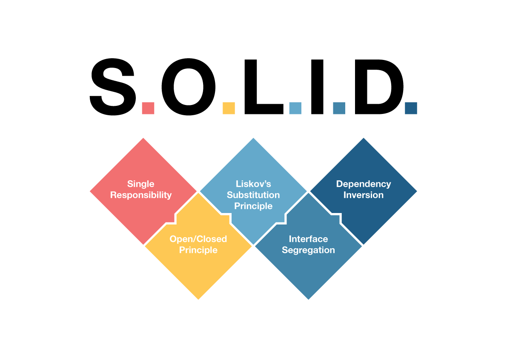

---

## **Single Responsibility Principle (SRP)**

A class should have only one reason to change.

----
### Single Responsibility Principle (SRP)
#### **DON'T DO THIS**

_<small>It may look suitable for a developer to have only one method to get shifts from an hubler</small>_

```typescript
class Hubler {
  getShifts() {
    // send shifts done by hubler
  }
}
```
Note: Je parle ici de mes grosses baloches
----
### Single Responsibility Principle (SRP)
#### **DO THIS**
_<small>Getting shifts of a given hubler is not the same if we want to display the calendar or if we want to know their planning from an admin point of view as different rules may apply to retrieve them</small>_

```typescript
class HublerPlanning {
  getShifts() {
    // send shifts done by hubler
  }
}

class InstitutionHublerAvailabilities {
  getShifts() {
    // send shifts done by hubler in an institution
  }
}
```
---

## **Open/Closed** Principle (OCP)

Software entities should be open for extension, but closed for modification.

----
### Open/Closed Principle (OCP)
#### **DON'T DO THIS**
<span style="font-size: 0.8em">

```typescript
class Shift {
  post() {
    // save in DB
    this.notify();
  }
  notify() {
    // send notification to hubler of the institution
  }
}
class HubloPoolShift extends Shift {
  notify() {
    // send notification to hublo poolers
  }
}
```

</span>

----
### Open/Closed Principle (OCP)
#### **DO THIS**

<span style="font-size: 0.8em">

```typescript
abstract class Shift {
  post() {
    // save in DB
    this.notify();
  }
  abstract notify();
}

class HubloPoolShift extends Shift {
  notify() {
    // send notification to hublo pool
  }
}

class NativeShift extends Shift {
  notify() {
    // send notification to hubler
  }
}
```
</span>

---

## **Liskov Substitution Principle (LSP)** 

Subtypes must be substitutable for their base types.

----
### Liskov Substitution Principle (LSP)
#### LISKOV PRINCIPLE **VIOLATION** 

_<small>By weakening the return type</small>_

<span style="font-size: 0.8em">

```typescript
interface MissionPort {
  findMission(): Promise<Mission>
}

class MissionRepository extends MissionPort {
  findMission() {
    const mission = this.missions.find(mission => mission.id === id)
  
      
    // returns Promise<Mission | undefined> instead of Promise<Mission>
    return Promise.resolve(mission);
  }
}
```

</span>

----
### Liskov Substitution Principle (LSP)
#### LISKOV PRINCIPLE **VIOLATION**

_<small>By strengthening the preconditions</small>_

```typescript
class Mission {
    setIdMotif(idMotif: number) {
        this.idMotif = idMotif;
    }
}

class PrismaMission extends Mission {
    setIdMotif(idMotif: number) {
        if (idMotif === 1) {
            throw new Error('Invalid idMotif');
        }
        this.idMotif = idMotif;
    }
}
```

---

## **Interface Segregation Principle (ISP)** 

No client should be forced to depend on methods it does not use.

----
### Interface Segregation Principle (ISP)
#### **DON'T DO THIS**
```typescript
interface UserShiftService {
  createShift();
  getShift();
  fillShift();
  updateShift();
}
```
----
### Interface Segregation Principle (ISP)
#### **DO THIS**
```typescript
interface HublerShiftService {
  getShift();
  fillShift();
}

interface AdminShiftService {
  createShift();
  updateShift();
}
```
---

## **Dependency Inversion Principle (DIP)** 

Depend on abstractions, not on concretions.

----
### Dependency Inversion Principle (DIP)
#### **DON'T DO THIS**

_<small>For each persistence we need to redefine a whole new service even if the business logic is the same</small>_

<span style="font-size: 0.6em">

```typescript
class ShiftOfferService {
  constructor() {
    this.db = new ShiftOfferMongoDB();
  }
  
  postShiftOffer() {
    this.db.save();
  }
}

class HubloPoolShiftOfferService extends ShiftOfferService {
  constructor() {
    this.db = new HubloPoolShiftOfferMongoDB();
  }
}

class TestShiftOfferService extends ShiftOfferService {
  constructor() {
    this.db = new InMemoryDb();
  }
}
```

</span>

----
### Dependency Inversion Principle (DIP)
#### **DO THIS**


_<small>You inject the accurate persistence layer directly</small>_

<span style="font-size: 0.8em">

```typescript
interface ShiftOfferRepository {
  save();
}

class MongoDBShiftOfferRepository implements ShiftOfferRepository {
  //...
}

class ShiftOfferService {
  constructor(private db: ShiftOfferRepository) {}
  
  postShiftOffer() {
    this.db.save();
  }
}
```

</span>

